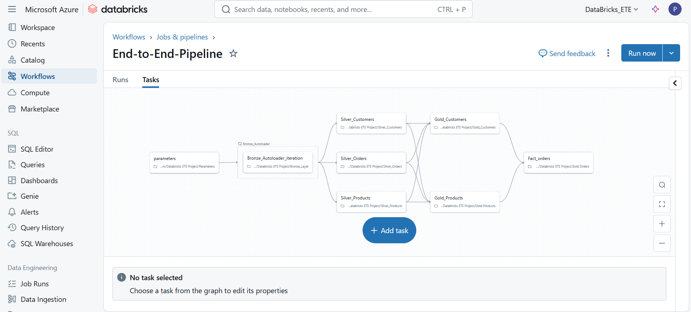

# 🚀 Databricks End-to-End ETL Pipeline Project

This project implements a fully automated ETL pipeline on Azure Databricks using Delta Lake for storing data in Bronze, Silver, and Gold tables. The pipeline is orchestrated with Databricks Workflows, and parameterized ingestion is used to fetch data from the Azure Data Lake.

 - Key techniques used:

 - Delta Lake for reliable and optimized data storage

 - Slowly Changing Dimensions (SCD) Type 1 & 2 transformations

 - Delta Live Tables (DLT) for managing streaming and batch data pipelines

## 🏗️ Pipeline Overview

The pipeline consists of three key layers: Bronze, Silver, and Gold. Each layer is designed for a specific stage in the data processing pipeline.

1. Data Ingestion (Bronze Layer)
   
   - Data is ingested from the Azure Data Lake using parameterized workflows, which allows flexibility in fetching data based on the workflow parameters.
   - The data is stored in Delta tables in the Bronze layer for initial processing.
   - The ingested raw data is then made available in the Delta Lake catalog for further transformations.

2. Data Transformation (Silver Layer)
   
   - The Silver layer involves the cleaning and transformation of raw data from the Bronze layer.
   - Common transformations include data cleansing (removal of nulls, duplicates, etc.) and filtering.
   - Cleaned data is stored in Delta tables within the Silver layer, and these tables are cataloged for further use.
   - The Silver layer prepares data for more complex transformations in the Gold layer.

3. Advanced Transformations & SCD (Gold Layer)
 
   - The Gold layer focuses on business-level transformations and applying Slowly Changing Dimensions (SCD) techniques.
   - SCD Type 1 (Overwrite): For attributes that require updates with the most recent values, SCD Type 1 is applied to overwrite previous records.
   - SCD Type 2 (Historical Tracking): For attributes that require historical tracking (i.e., when a value changes but we need to keep track of old values), SCD Type 2 is        used to insert new records with versioning.
   - After applying the SCD transformations, the data is organized into dimension and fact tables for use in reporting or further analysis.

**🔑Key Technologies & Techniques Used**

 **Azure Databricks:** Used as the orchestration engine for building the pipeline and managing the Databricks Jobs.

 **Delta Lake:** For storing data in an optimized, ACID-compliant format. Ensures data consistency and provides support for schema evolution and enforcement.

 **Delta Live Tables (DLT)**: Managed batch and streaming data pipelines with automatic handling of incremental data processing.

 **SCD Type 1 & Type 2:** Used for handling changes in dimensional data over time:

- SCD Type 1 for overwriting outdated records with the latest version.

- SCD Type 2 for maintaining historical records when attributes change.

---

## 🏗️ Project Architecture

---

## 🔁 ETL Pipeline Flow

1. **Bronze Layer**  
   - Ingest raw `orders`, `customers`, and `products` data into Delta tables.

2. **Silver Layer**  
   - Clean, transform, and normalize the data.
   - Handle nulls, types, and dates.

3. **Gold Layer**  
   - Create:
     - `DimCustomer` with surrogate keys
     - `DimProduct` with validation logic
     - `FactOrders` by joining Silver orders with Dim tables

4. **Workflow**  
   - Orchestrated in Databricks Workflows to automate Bronze → Gold flow.

---

## 📁 Project Structure

databricks-etl-pipeline-project/                                                                                                                                               
├── notebooks/      # All .py notebooks for each ETL layer (bronze, silver, gold)                                                                                              
├── data_sample/    # Sample datasets used for local or testing purposes                                                                                                        
├── sql/            # SQL scripts for table creation (optional)                                                                                                                
├── pipeline/       # Workflow screenshots & architecture diagrams                                                                                                             
└── README.md       # Project overview and documentation

---

## 🧱 Technologies Used

- Azure Databricks (Community Edition compatible)
- PySpark (DataFrame API)
- Delta Lake
- Azure Data Lake Storage (optional)
- Databricks Workflows

---

## 📊 Final Output Tables (Gold Layer)

| Table Name           | Description                              |
|----------------------|------------------------------------------|
| `DimCustomer`        | Customer dimension with surrogate keys   |
| `DimProduct`         | Product dimension with validation logic  |
| `FactOrders`         | Fact table joined on surrogate keys      |

---

## 🚀 How to Run

1. Upload the `notebooks/` to your Databricks Workspace.
2. Upload CSVs (if needed) to your DBFS or mount to Azure.
3. Create and configure your Workflow using `pipeline/workflow_screenshot.png` as reference.
4. Run from **Bronze → Silver → Gold** notebooks.
5. Check output Delta tables using Catalog Explorer.

---

## 📊 Final Output

- `databricks_cata.gold.DimCustomer`
- `databricks_cata.gold.DimProducts`
- `databricks_cata.gold.FactOrders`

Each table is queryable via Delta Lake with clean, deduplicated, and surrogate-key-joined records.

---

## 🧑‍💻 Author
 
- **Name:** Pranith Kumar Dongari 
- **LinkedIn:** https://www.linkedin.com/in/pranithkumar
- **GitHub:** https://github.com/Pranith-cloud
  
💡 Passionate about Data Engineering & Analytics

## 🔮 Future Enhancements

- Integrate with Power BI or Looker for dashboard visualization
- Add unit testing for transformation logic using `pytest`
- Add CI/CD deployment using GitHub Actions for notebook promotion
- Incorporate data quality checks using expectations in Delta Live Tables
- Use Azure Data Factory to trigger pipelines via REST API
- Execute the full pipeline on a paid subscription to avoid cluster quota limits

